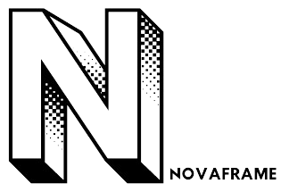

## Attention
- **This project is educational purpose only.**
- **If project name `NOVAFRAME` is already taken, please let me know.**

## Description
- **NOVAFRAME** is a basic web framework that provides common tasks that every web application needed.
  - MVC structure
  - Simple Routing (can filter route with middleware)
  - Events
  - Middlewares
  - Validation
  - Database Query Builder
- It aims to simplify the development process.
- It is inspired by various **PHP Frameworks**, especially from **[LARAVEL](https://laravel.com)**, **[Codeigniter](https://codeigniter.com)** and **[PHPLucidFrame](https://www.phplucidframe.com)**

## Contributing
- **NOVAFRAME** is an open-source project, and contributions are welcome.
- If you have any suggestions, bug reports, or feature requests, please open an issue or submit a pull request on the project repository.

## Requirement
- Apache's mode_rewrite module must be enabled on your web server.
- **PHP** version 8.2 or newer is required.
- Composer
